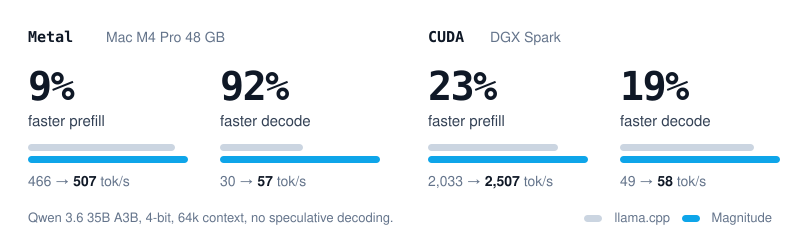

  <picture>
    <source media="(prefers-color-scheme: dark)" srcset="assets/brand/icon-dark.svg">
    <source media="(prefers-color-scheme: light)" srcset="assets/brand/icon-light.svg">
    
  </picture>

<h1 align="center">Magnitude</h1>

<strong>Run open models as fast as your hardware allows</strong>

  
  
  
  
  

Magnitude is an open source inference engine for agents that optimizes itself for your exact hardware. It compiles and tunes its kernels on your device, so open models run up to 2x faster than llama.cpp. One click connects the agent you already use (Pi, OpenCode, Hermes, Codex, and more). Works on Apple Silicon, NVIDIA, AMD, or nothing but a CPU.

**[Download Magnitude for macOS, Windows, or Linux](https://magnitude.dev/download)**

⭐ Help us reach more developers and grow the Magnitude community. Star this repo!

https://github.com/user-attachments/assets/983328c8-93e8-4360-bfef-11e93ff76035

## Get started

1. [Download Magnitude](https://magnitude.dev/download), install it, and open the app.
2. Choose a recommended model in **Discover** and download it.
3. Connect your agent in **Connections** and start using it.

The desktop app includes the `magnitude` CLI. No separate installation is needed.

## Why Magnitude?

- **Up to 2x faster than llama.cpp:** 92% faster decode on Metal, 19% on CUDA
- **Tuned on your device:** kernels are tuned on your hardware before a model runs
- **Built for the best models:** hand-optimized kernels for popular open-weight families
- **Memory that flexes:** 27% less memory per agent, freed when agents stop
- **Fast concurrent sessions:** sessions share prefix caches to prevent slowdown
- **Works with your agent:** one click to connect Pi, OpenCode, Hermes, Codex, and more
- **Free, private, open source:** no token costs, nothing leaves your machine, Apache 2.0

## Up to 2x faster than llama.cpp

<picture>
  <source media="(prefers-color-scheme: dark)" srcset="assets/benchmarks/llama-cpp-dark.svg">
  
</picture>

## FAQ

### What is Magnitude?

An open source inference engine that optimizes itself for your hardware. It ships as a desktop app that runs open models and connects them to the agent you already use.

### How is it faster than llama.cpp, Ollama, or LM Studio?

They ship kernels precompiled for broad classes of hardware. Magnitude compiles and tunes its kernels on your actual device before a model runs, so they fit your exact chip. [See the benchmarks against llama.cpp.](#up-to-2x-faster-than-llamacpp)

### What hardware do I need?

Any Apple Silicon, NVIDIA, or AMD GPU, or nothing but a CPU. There is no fixed minimum. Smaller machines run smaller models, and more memory lets you run larger ones.

### What operating systems does it support?

macOS, Linux, and Windows.

### Which models does it support?

See the full list at [magnitude.dev/models](https://magnitude.dev/models). We write optimized kernels for the most popular open-weight families, which is how we beat generalist engines.

### Which agents work with it?

One click connects Pi, OpenCode, Hermes, OpenClaw, Codex, Claude Code, Oh My Pi, and Cline. Anything else works through the OpenAI-compatible API.

### Is it private?

Yes. Prompts, files, and models stay on your machine. No internet needed once a model is downloaded.
