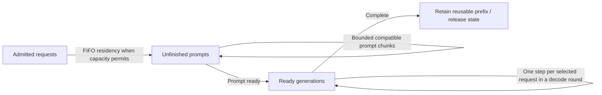
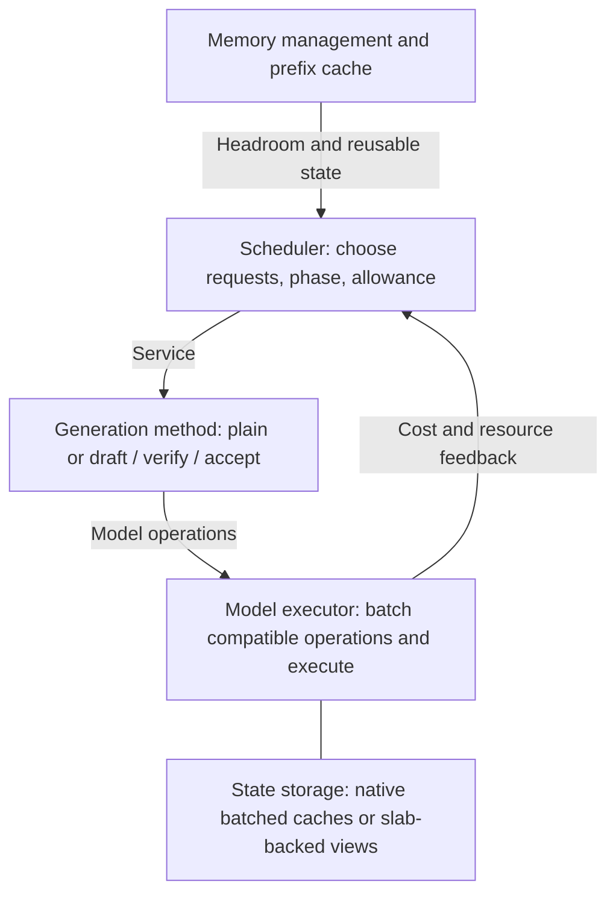
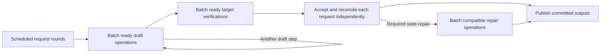

---
applies_to:
  - inference/engine/scheduler/**
  - inference/engine/batching/**
  - inference/engine/src/worker/execution.rs
---

# Scheduler

**Continuous batching with token-bounded, time-shared prefill and decode.** Batch
compatible work to execute efficiently. Share execution time to keep ongoing
generations responsive while new prompts make progress.

## Request flow



Residency reserves room for state growth and execution, not just existing KV.
Admission is logical and immediate. A request becomes resident when rounds are
formed, between flights, so capacity can grow without waiting for an active
generation to finish. Work that cannot be provisioned is parked on its request,
which waits alone; the pipeline waits only on its flight. A round starts only
with publication credit. Status and lifecycle commands remain
available during the flight.
Prefix reuse reduces remaining prompt work; reclaimable cached state can make
room for active requests. The [prefix cache](prefix-cache.md) defines what is
cached, when a request resumes from it, and how residency is regained. Output-blocked requests are ineligible until ready
again. Cancellation removes future work, with resource release after in-flight
execution completes.

## Execution thread

One thread owns execution. Each piece has one job:

| Piece | Owns | Does not own |
|---|---|---|
| Worker | Thread confinement, mailbox, replies, sleeping | Any scheduling, storage or lifecycle decision |
| Execution lifecycle | Serving, Draining or Stopped, and the typed stop cause | What runs |
| Owner | The one schedule: request states, rounds, the pipeline | Physical holds |
| Executor and state stores | The binding right, flights, the lookahead, slabs, rows, banks ([state transactions](state-transactions.md)) | When requests become resident |

**The worker is an event pump.** Its events are a flight's completion, a publication wake, and a
request's cancellation (by its host, or by a dropped admission reply). It applies events and
controls in arrival order, runs every possible owner transition, then sleeps until the next event
or the next memory observation. A control executes at once; nothing is deferred or refused for
"not now". A completion exists only for a flight in the air. There is no periodic re-drive.

**Lifecycle.** Close and memory escalation (persistent Reclaim) move Serving to Draining: every
live request terminates with the cause, the pipeline finishes its flight, and execution stops once
the pipeline is Idle. A device or engine fault stops at once with its classified error; a panic in
the owner stops with an internal cause. The stop cause closes the mailbox, fails every pending
control, and is the one stop signal the host reads.

**Pipeline.** Idle, between flights and holding the binding right; or InFlight, one group on the
device whose flight holds the binding right until completion returns it. In Idle the owner selects
a round and submits its groups in order. Completion reconciles the group, queues its follow-up
operations in the round and continues it; an exhausted round returns to Idle. The pipeline waits
on nothing but its flight: one request's shortage or one slow consumer never stops the others.

**Request states.** A request has one state in one place: the owner's table, or the current round
while its work is in it; in Idle every request is in the table. Outside a round a request awaits a
peer's prefix, is non-resident, ready, awaiting credit, pending (image encodes or drafter work to
submit before a round), or parked (a started round whose next operation couldn't be provisioned,
submitted unchanged when selected). Non-resident, pending and parked work may carry a wait:
capacity at an availability epoch, or memory. A started round is a value that owns its generation.

| State | Ended by |
|---|---|
| In the pipeline's round | Its flight's completion |
| Awaiting credit | A publication wake |
| Memory wait | An observation that returns Normal |
| Capacity wait | The availability epoch advancing |
| Awaiting a prefix | Its peer caching the prefix, or no longer computing it |

Provisioning a group first applies the [release order](memory.md#release-order). If the group
still doesn't fit, each of its requests leaves the round with its operations, parked or pending,
with a capacity wait at the current epoch, or a memory wait in Blind or Reclaim.

**The availability epoch advances exactly when capacity is freed:** a reconciled completion, a
request ending or being evicted, a release or shrink, memory returning to Normal, or memory freed
elsewhere covering a recorded deficit. Rounds finishing, admissions and prefix releases free
nothing and don't advance it.

**Capacity rule.** In Idle, when memory is Normal and no request awaits host credit or memory or
has finished with state still to release, nothing can advance the epoch. Every capacity wait then
ends in its typed capacity error. That also ends any prefix wait on those requests, and the waiter
proceeds on its own. Every chain of waits therefore ends in a flight, the host, a memory
observation, or a typed outcome.

## Choosing what runs next

The scheduler alternates **decode rounds** and **prompt chunks**, using measured
execution time to decide how many rounds belong between chunks.

- A decode round advances ready generations in scheduling order until its
  aggregate token allowance is spent. Remaining generations wait for the next
  round. Compatible operations run together; incompatible groups run separately.
- Every round also spends a selection budget, the decode allowance: a selected
  row or a drafting request takes one. A decode round never exhausts it before
  its token allowance. A prompt chunk that would finish its prompt with the
  budget spent stops one row before the prompt's end and finishes in a later
  round.
- A prompt service shares one aggregate token allowance across admitted unfinished
  prompts compatible with the oldest admitted prompt, in FIFO order. Compatibility
  comes from the live generation/model contract; an unbatchable prompt keeps the
  whole allowance. Equal-sized chunks expose compatible execution batches;
  shorter tails form separate groups without padding or extending their context.
  Its allowance respects memory headroom and, when explicitly requested, the
  remaining interruption-duration budget. Consecutive prompt services share that
  optional budget; reaching it requires a decode round. One waiting prompt
  receives the whole allowance.
- While both phases are ready, prefill consumes a time budget that decode must
  replenish. Begin with a decode round, allow a chunk, then run enough decode
  rounds to repay that chunk's time debt before another chunk.
- If only one phase is ready, it runs without time-share throttling. Prefill can
  use larger chunks when decode is absent. Reset contention accounting instead
  of accumulating credit during idle periods.

Example: equal time shares, 40 ms prompt chunks, and 10 ms decode rounds:

```text
Time →  [prefill: 40 ms][D: 10][D: 10][D: 10][D: 10][prefill: 40 ms] …
         bounded stall  └──── decode receives 40 ms ────┘

Each D advances ready generations within its token allowance through compatible
execution batches.
```

**Two controls, two purposes:** an optional duration target limits individual interruptions;
the decode share limits sustained prefill interference. For decode share `s`, a
chunk lasting `p` incurs `p × s / (1 − s)` of decode debt. Carry repayment
overshoot forward, capped at one decode round, while contention continues.
The interruption bound takes precedence if indivisible decode rounds prevent
matching the requested share. Equal shares and the example durations are
evaluation choices, not fixed defaults.
The baseline uses bounded token chunks and measured time sharing without a
duration target. A caller choosing a duration target accepts its throughput cost:
small chunks can repeatedly pay model execution overhead. Compare latency and
throughput under the declared policy, rather than equating different interruption
guarantees. The token bound applies with or without a duration target.

Measure completed execution service, not asynchronous submission time or emitted
token counts. Bounds are approximate at indivisible execution boundaries;
bounded submission lookahead must preserve opportunities to reschedule.
Worker idleness follows the absence of execution service, not the absence of
published tokens. Drafting or suspended verification is still forward progress.

## Composition and ownership



The scheduler is an injected engine component. Generation methods define what a
step means; executors expose compatibility, cost, and resource requirements.
Models, kernels, and streaming implementations introduce no scheduler branches.
The service owner is generic over the numerical program family; it observes the same typed
completion and reconciliation lifecycle whether that family returns ready or pending submissions.
The root closes the family type at worker construction, leaving the host command interface
non-generic.
Prompt processing exposes ordinary causal model operations too. Shared device
completion precedes each request's prompt-feature publication and checkpointing.
Phase feedback counts physical service once; per-request metrics include the
shared work that request participated in, excluding unrelated groups and retention.

**Batch membership is physical; request identity is logical.** The executor
preserves useful batched state between steps and changes membership as requests
join or leave. It does not rebuild the entire KV cache every token. Prefill and
decode initially use separate, interleaved forwards. Slabs determine state
storage, not scheduling policy.

## Batched speculative generation

Speculation is part of ordinary decode service. A scheduled request owns a
bounded, resumable generation round; its method exposes model work instead of
executing an entire private drafting loop. The generation runtime advances these
rounds together and the executor batches compatible operations at each stage.



There is no batch-wide acceptance length or permanent speculative cohort. Plain
requests, different proposal widths, and different acceptance lengths share the
same service and execution contracts. Physical grouping is by executor capability;
state, sampling, constraints, and drafter alignment remain per request. Actual
drafting, verification, and repair time all count as decode service, once per
execution. Prefill/decode fusion remains deferred.

See [Speculative generation](speculative-generation.md) for the round contract,
state boundaries, exceptional cases, and implementation approach. A round can
resume across bounded services; unfinished drafting or repair does not require
holding the scheduler until the entire round completes. A scheduling yield does
not itself synchronize the GPU.

## Trade-offs and qualification

More decode protection increases prompt latency. Sharing prompt work can delay
the oldest prompt's first token while bringing peer prompts to decode sooner.
FIFO admission still lets active long prompts delay queued requests. Larger batches
can improve total throughput while increasing
per-request latency and memory traffic. This policy shares one engine's execution
time; it does not coordinate unrelated GPU processes.

Qualify decode batches at equal and mixed context lengths, then prompt arrivals
during decode. Measure first-token and inter-token latency distributions, prompt
progress, throughput, and time sharing. Separate computation, batch formation,
state movement, and engine overhead. Verify membership changes, cancellation,
backpressure, prefix reuse, and memory pressure preserve request and peer state.
Qualify all four combinations of single/multiple sessions and plain/speculative
composition, plus transitions between session counts. Each must preserve the
efficient execution behavior specified in the
[performance contract](speculative-generation.md#performance-contract).

## Acceptance criteria

- A request admitted while a flight or its lookahead holds state is admitted immediately and
  becomes resident in a later round, with no worker spin.
- With no events, the worker runs the owner once per memory observation interval.
- A request short of capacity parks only its own work; peers keep running, and the parked work is
  submitted unchanged once capacity is freed.
- When every live request is short, each takes its typed capacity error; a request awaiting a
  short peer's prefix proceeds on its own.
- A slow consumer stops only its own request, before it starts a round.
- Memory waits in Blind or Reclaim end on the return to Normal.
- Close or memory escalation during a flight lets the flight finish, then stops; every live
  request and pending control receives the stop cause.
